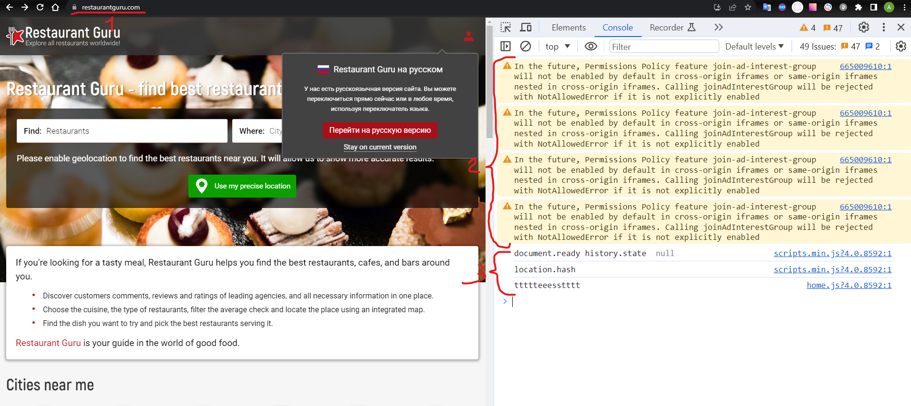
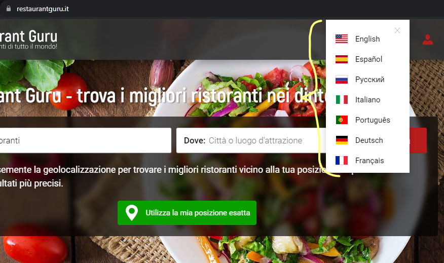
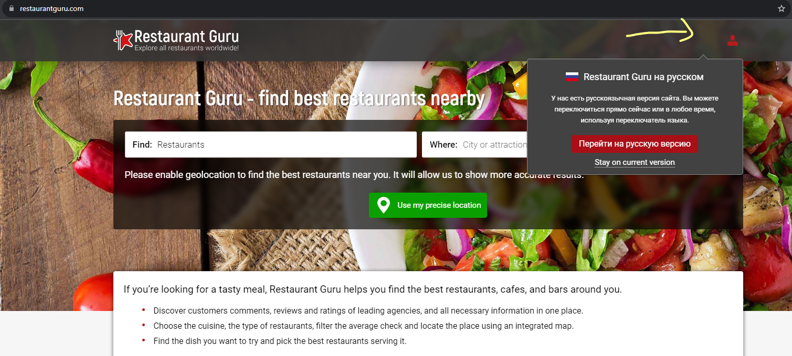

ID: 000
Заголовок: Шаблон баг-репорта
Описание:
Проект: https://restaurantguru.com
Версия: test_mode_on_3
Окружение: desktop (Chrome. Версия 119.0.6045.160)
Серьезность бага: Не критично
Статус: New
Автор: QA Engineer Королев А.В.
Исполнитель: Developer #N
Шаги воспроизведения:
Ожидаемый результат:
Фактический результат:
Дополнения:

===

ID: 001
Заголовок: "грязная консоль"
Описание: При работе с сайтом в режиме разработчика (devtools) в консоле выявлены предупреждения и служебная информация разработчика
Проект: https://restaurantguru.com
Версия: test_mode_on_3
Окружение: desktop (Chrome. Версия 119.0.6045.160)
Серьезность бага: Не критично
Статус: New
Автор: QA Engineer Королев А.В.
Исполнитель: Developer #N

Шаги воспроизведения:

1. Запустить браузер и открыть devtools
2. Перейти по прямой ссылке https://restaurantguru.com
   Ожидаемый результат: консоль пустая (без ошибок, предупреждений и служебной информации)
   Фактический результат: присутсвуют предупрждения и служебная информация 01
   Дополнения: 

===

ID: 002
Заголовок: Шаблон баг-репорта
Описание:
Проект: https://restaurantguru.com
Версия: test_mode_on_3
Окружение: desktop (Chrome. Версия 119.0.6045.160)
Серьезность бага: Не критично
Статус: New
Автор: QA Engineer Королев А.В.
Исполнитель: Developer #N
Шаги воспроизведения:
Ожидаемый результат:
Фактический результат:
Дополнения:

===

https://restaurantguru.it/ не работает смена языка 

===

https://restaurantguru.com отсуствие иконки локализации когда появляется модальное окно с предложением сменитть язык 

===

если появляется модальное окно спредложением переейти в русский режим то по клику ничего не просиходит

===

Постоянный редирект на .it

===
